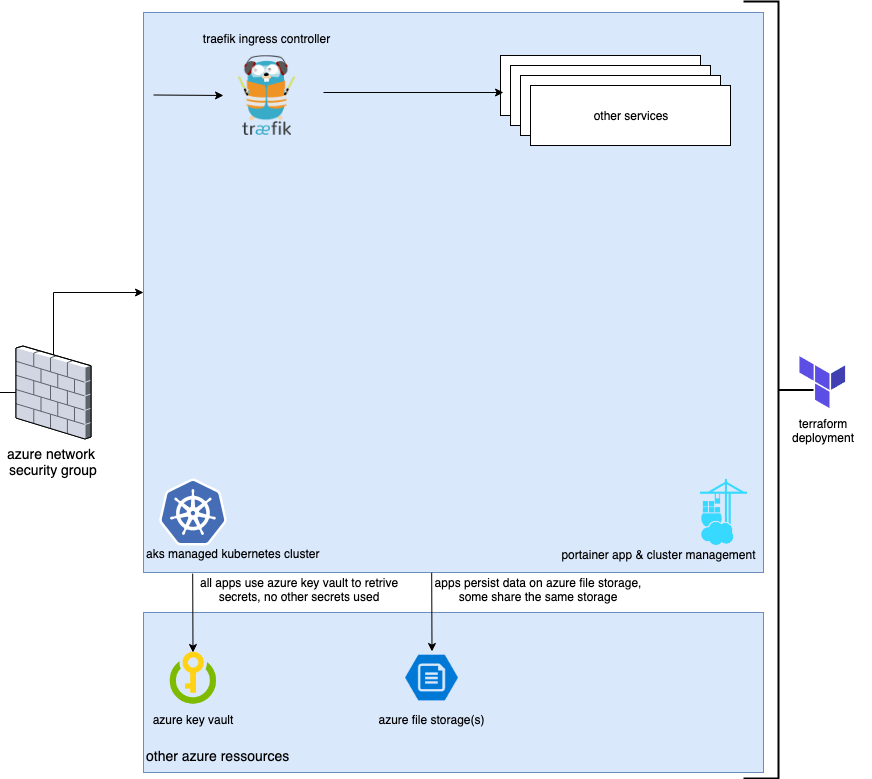

# Introduction 
Deplyoing a managed kubernetes cluster in azure (aks). Basically what you see below. The apps / services in the cluster will be described in a later example.



# Getting Started

## k8s cluster initial
Git clone this repo.

```
cd 01-k8s-cluster

## Hashi Corp Terraform with Azure
# Create an Azure service principal with Azure CLI
# https://docs.microsoft.com/en-us/cli/azure/create-an-azure-service-principal-azure-cli?view=azure-cli-latest
az ad sp create-for-rbac --name svprTerraform

APP_ID=
TENANT_ID=
PASSWORD=

## only examples
#az role assignment delete --assignee $APP_ID --role Reader
#az role assignment create --assignee $APP_ID --role Contributor
## test login
#az login --service-principal --username $APP_ID --password $PASSWORD --tenant $TENANT_ID

# Install and configure Terraform to provision Azure resources
# https://docs.microsoft.com/en-us/azure/terraform/terraform-install-configure

# Set up Azure storage to store Terraform state
az storage container create -n tfstate --account-name stdefaultkstjj001 --account-key <YourAzureStorageAccountKey>

# Create the Kubernetes cluster
terraform init -backend-config="storage_account_name=stdefaultkstjj001" -backend-config="container_name=tfstate" -backend-config="access_key=<YourAzureStorageAccountKey>" -backend-config="key=codelab.microsoft.tfstate"

export TF_VAR_client_id=$APP_ID
export TF_VAR_client_secret=$PASSWORD

terraform plan -out out.plan
terraform apply out.plan

#Test the Kubernetes cluster
echo "$(terraform output kube_config)" > ./azurek8s
export KUBECONFIG=./azurek8s

az aks get-credentials --resource-group rg-k8s-kstjj-001 --name aks-k8s

kubectl get nodes

```

## k8s cluster update

```
APP_ID=
PASSWORD=
TENANT_ID=
ADMINUSER=

export TF_VAR_client_id=$APP_ID \
export TF_VAR_client_secret=$PASSWORD \
export TF_VAR_tenant_id=$TENANT_ID \
export TF_VAR_admin_client_id=$ADMINUSER \

terraform plan -out out.plan
terraform apply out.plan
```
