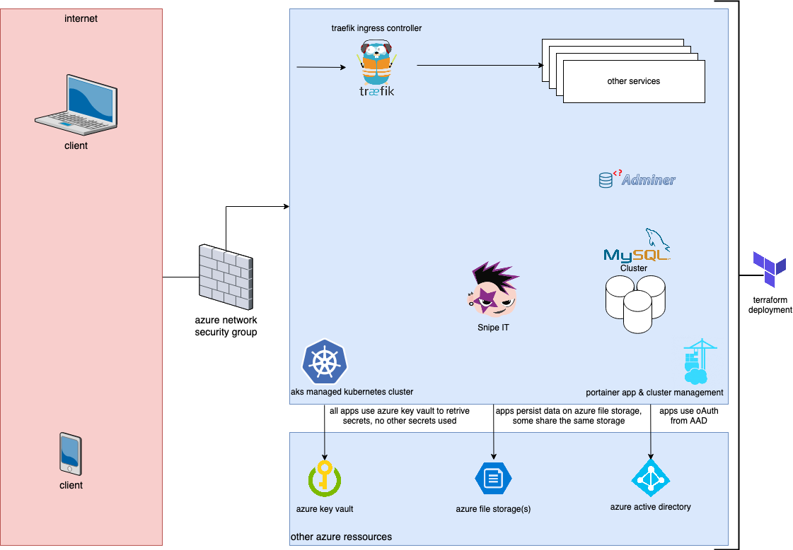

# the collectors edition
A bunch of configs, examples and so on for different technologies and tools we have been using in the past. Our goal to help others get things done faster and skip a part of the learning curve.

# what is in it?

| # | app / tech  | description  |
|---|---|---|
| 1 | [nginx](001-nginx) | contains best practise reverse proxy configs for multiple pages including let's encrypt |
| 2 | [portainer](002-portainer) | portainer on docker, docker swarm and kubernetes |
| 3 | [terraform](003-terraform) | creating MSFT azure resources with terraform |
| 4 | [kubernetes](004-kubernetes) | a bunch of yaml files for stacks running on aks |
| 5 | [docker](005-docker) | some docker compose files |
| 6 | [graylog](006-graylog) | some lessons learned setting up graylog |
| 7 | [ansible](007-ansible) | automating setup of my mac with ansible |

# overview
Many of the components are used in a kubernetes cluster designed as shown in the picture below.

(test: ahead of master)